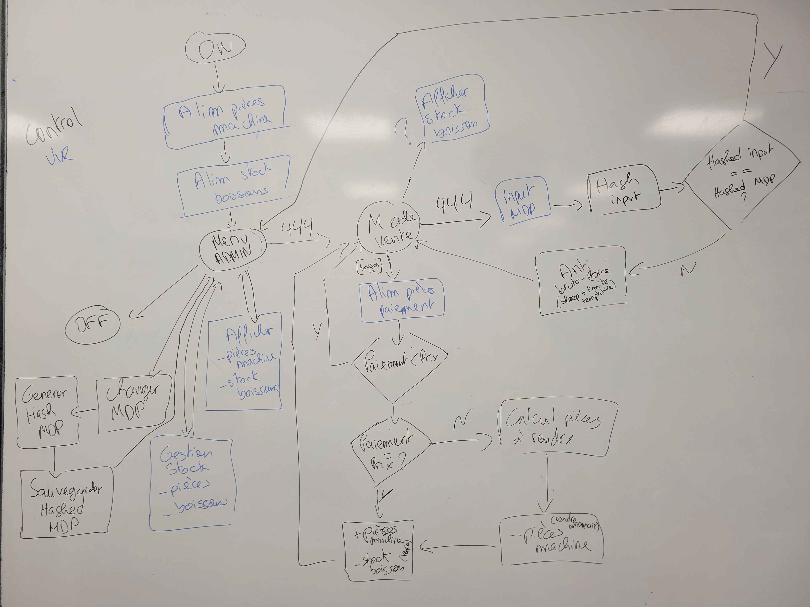
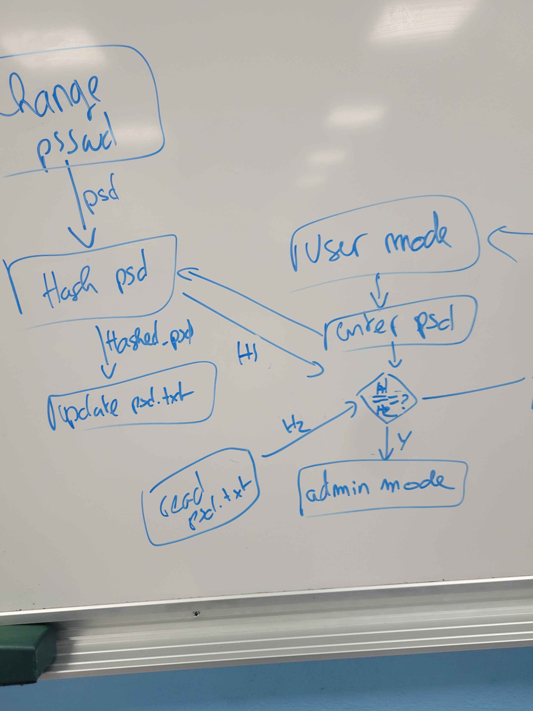

# Machine a cafe - Projet ISEN Algo - Peter Chatzigianis Cyber1

Date sur les commits, plutot qu'ecrire ici et oublier de mettre a j.
 

## Download

Que des librairies standards.\\
Donc aucun pre-requis necessaire.
 

## Build

Il y as un makefile pour build et run le programme.\\
On as juste donc a ecrire: make\\
(a partir du repertoire ultime-cafe, toute facon yas qun seul makefile)\\

Par defaut, mon make execute run:\\

- debug (pour le debugger pas a pas)\\
- build (setup et puis gcc)\\
  - setup (creer le repertoire pour l'exec)\\
  - Flags du gcc :\\
    - O0, Aucune optimisation par le preprocesseur\\
      (C'etait pour voir ce que donne le code en hex et asm grace a des extensions)\\
    - Wall, Montre tout les warnings\\
    - Werror, Tout les warnings devient des erreurs et empeche la compilation\\
- execute le programme
 

## Versions

J'ai refactoriser de 0 le code entre chaque version.\\

V1\\
C'etait juste une version le plus rush possible faites en cours.\\
Ca m'as servis pour avoir une idee de ce qu'il vas me falloir.\\
Ainsi des axes d'ameliorations.\\

V2\\
https://github.com/p-chatzi/machine-a-cafe \\
Je l'ai trouver un peu ambigu et brouillon.\\

V3\\
C'est celle-ci, la finale - Voici mon plan de la machine:\\
\\
 

## Hash

Le mdp est hash avec une fonction que j'ai faite.\\
Elle est base sur ce qu'on as vu en cours, meme si legerement different.\\
Ensuite sauvegarder dans un fichier txt.\\
En ouvrant le fichier en voit donc que le hash et pas le mdp en clair.\\
Parreil dans le code il n'y as pas de mdp en clair.\\ 

 

## De quoi est capable la machine

Fonctions de base:\\
Menu admin (Entrer et voir le stock de pieces, finir/commencer la journee)\\
Gestion de base des pieces de la machine et de l'utilisateur\\
Calcul donc de pieces a rendre et des verifications necessaires.\\

Bonus:\\
Gestion du stock de boissons.\\

+:\\
MDP pour l'admin, hash et sauvegarder.\\
Organisation en : modele, vue, controlleur\\
Git - en local jusqu'a la fin\\
j'avais fini la V2 donc si je perdais mes donnees je pouvais me rabattre dessus.
 

## Utilisation de l'IA (mes "sources")

J'ai pas mal utilise les IAs suivantes :\\
Perplexity + Copilot\\

Perplexity:\\
1/ Recherche en ligne plus efficace\\
2/ Generation ascii et allignement de l'ascii\\

Copilot:\\
1/ Autocompletion de la ligne\\
(Typiquement on s'est deja ce qu'on vas ecrire dans la ligne mais on ecrit lentement)\\
2/ Generation des commentaires et de l'affichage
 

## Fun fact

Pendant que je travaillais sur ma machine a cafe, j'ai voulu prendre un snack.\\
La machine au rdc de l'ISEN as pris mon payement en CB sans rien me donner.\\
Where is my cookie? :'( *sniff *sniff )':
